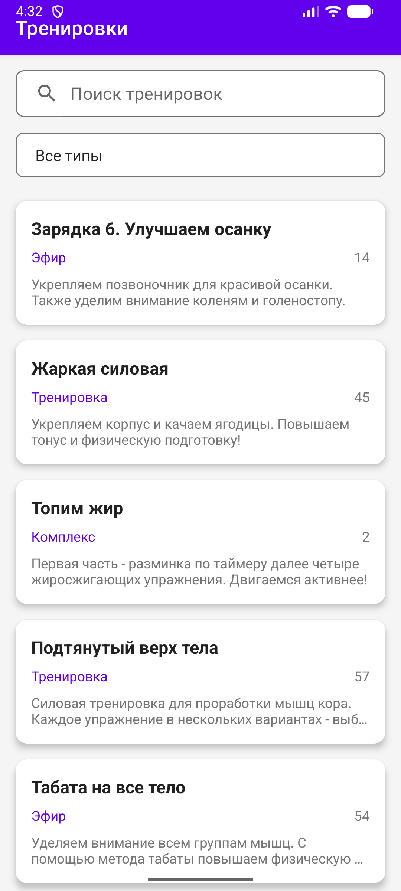
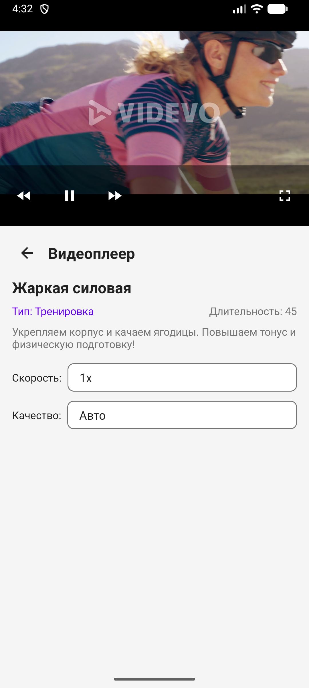
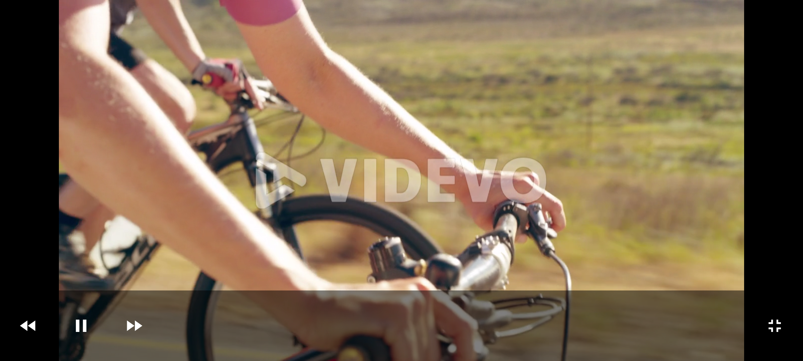

# Fitness App

Android-приложение для просмотра списка тренировок и воспроизведения видео.

## Функциональность

### Экран 1 — Список тренировок
- Отображение списка (название, тип, длительность, описание)
- Поиск по названию
- Фильтрация по типу (Тренировка / Эфир / Комплекс)
- Состояния: loading / error / empty с кнопкой "Повторить"

### Экран 2 — Видеоплеер
- Информация о тренировке
- Воспроизведение видео по URL через ExoPlayer
- Перемотка ±10 секунд
- Изменение скорости (0.5x — 2x)
- Выбор качества (UI)
- Полноэкранный режим

## Архитектура

Используется **Clean Architecture + MVVM**:

- **Presentation** — Activity, ViewModel, Adapter (XML layouts)
- **Domain** — Use Cases (`GetWorkoutsUseCase`, `GetVideoUseCase`)
- **Data** — Repository, Retrofit API, модели

Данные текут в одном направлении: `API → Repository → UseCase → ViewModel → View`.

 Асинхронность | Kotlin Coroutines + `viewModelScope` 
 Сеть | Retrofit 2 + OkHttp с логированием 
 Видео | Media3 ExoPlayer с поддержкой HTTP→HTTPS редиректов | Состояния UI | `sealed class Resource<T>` (Loading/Success/Error) 
 Список | `ListAdapter` + `DiffUtil` для оптимизации 
 UI | ViewBinding + Material Design 
 Lifecycle | Корректная обработка ExoPlayer 

 ## 📸 Скриншоты

| Список тренировок | Видеоплеер | Полноэкранный режим |
|-------------------|------------|---------------------|
|  |  |  |
